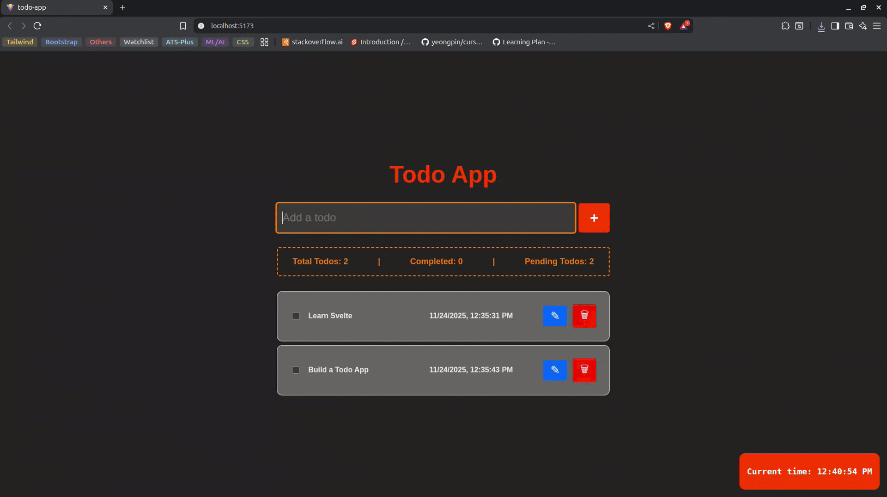

# Todo App - Svelte 5

A simple, functional todo application built with **Svelte 5** and **Vite** as part of a 5-day Svelte learning journey.

## 📸 Demo



## 🎯 Features

- ✅ **Add todos** - Create new tasks with Enter key or button click
- ✅ **Edit todos** - Modify existing tasks via a centered modal dialog
- ✅ **Delete todos** - Remove completed or unwanted tasks
- ✅ **Toggle completion** - Mark tasks as done with checkboxes
- ✅ **Statistics tracker** - View total, completed, and pending todos
- ✅ **Live clock** - Digital clock display in bottom-right corner
- ✅ **Empty state** - Helpful message when no todos exist
- ✅ **Timestamps** - Track when each todo was created

## 🧠 Concepts Used

This project demonstrates core Svelte 5 concepts learned over 4 days:

### Day 1: Project Setup
- Vite + Svelte template
- Development environment

### Day 2: Variables, Props & Reactivity
- `$state()` - Reactive state management
- `$derived()` - Computed values (totalTodos, completedTodos, pendingTodos)

### Day 3: Conditionals, Loops & Events
- `{#if}...{:else}` - Conditional rendering
- `{#each}` - List rendering with keys
- `onclick` / `onkeydown` - Event handlers

### Day 4: Bindings
- `bind:value` - Two-way input binding
- `bind:checked` - Checkbox binding
- `class:completed` - Dynamic CSS classes

## 🚀 Getting Started

### Prerequisites
- Node.js (v16 or higher)
- npm

### Installation

```bash
# Clone the repository
git clone <repository-url>

# Navigate to project directory
cd todo-app

# Install dependencies
npm install

# Start development server
npm run dev
```

The app will be available at `http://localhost:5173/`

## 📦 Build for Production

```bash
# Create optimized production build
npm run build

# Preview production build
npm run preview
```

## 🛠️ Tech Stack

- **Svelte 5** - Component framework
- **Vite** - Build tool and dev server
- **JavaScript** - Programming language
- **CSS** - Styling

## 📁 Project Structure

```
todo-app/
├── src/
│   ├── App.svelte      # Main todo app component
│   ├── main.js         # App entry point
│   └── app.css         # Global styles
├── public/             # Static assets
├── index.html          # HTML template
├── vite.config.js      # Vite configuration
└── package.json        # Dependencies and scripts
```

## 🎨 Features Breakdown

### Add Todo
- Input field with placeholder text
- Add button with "+" icon
- Enter key support for quick entry

### Edit Todo
- Click edit (✎) button to open modal
- Centered modal with backdrop
- Save/Cancel buttons
- Click outside to close

### Todo List Item
- Checkbox for completion toggle
- Strikethrough styling for completed items
- Creation timestamp
- Edit and delete buttons

### Statistics Bar
- Real-time count of total todos
- Completed todos counter
- Pending todos counter

### Live Clock
- Fixed position bottom-right
- Updates every second
- Digital clock styling

## 📝 Learning Journey

This project was built as part of **Day 5** of a Svelte learning path:
- **Day 1**: Introduction and setup
- **Day 2**: Variables, props, reactivity
- **Day 3**: Conditionals, loops, event handling
- **Day 4**: Bindings
- **Day 5**: Build complete todo app ✨

---

Built with ❤️ using Svelte 5
